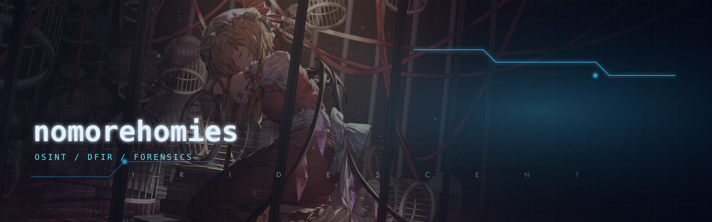

<div align="center">




<br />


</div>

---

### ~/identity

```txt
nomorehomies@deep-blue-lab:~$ whoami
[+] Cybersecurity student
[+] OSINT investigator
[+] Digital forensics learner
[+] Case writeup builder
[+] Evidence-first mindset
[+] Notes, scripts, timelines, and reproducible reports
```

I build investigation notes and small tools around **OSINT**, **digital forensics**, and cyber challenge workflows.  
The goal is simple: collect traces, verify evidence, build a timeline, and write conclusions that can be reproduced.

---

### Active Focus

| Zone | What I Work On | Output |
| --- | --- | --- |
| OSINT | usernames, domains, public traces, metadata, blockchain pivots | pivot maps, source notes, trace summaries |
| DFIR | memory dumps, browser artifacts, Android traces, file carving | timelines, extracted indicators, recovery notes |
| Casework | forensic-style challenges, recon notes, investigation tasks | writeups, commands, evidence proof |
| Automation | Python/Bash parsers for repetitive triage | scripts, checklists, helper tools |

---

### Toolbelt

<div align="center">


</div>

| Track | Tools / Methods |
| --- | --- |
| Recon | Nmap, ffuf, nuclei, DNS pivots, GitHub dorking |
| OSINT | Sherlock, SpiderFoot, theHarvester, Google dorking, archive checks |
| Forensics | Volatility 3, Autopsy, FTK Imager, binwalk, exiftool, strings |
| Network | Wireshark, tshark, PCAP reconstruction, traffic timelines |
| Reporting | Markdown notes, evidence tables, reproducible command logs |

---

### Lab Structure

```txt
01_osint-notes/       username pivots, domain recon, public-source traces
02_forensics-lab/    memory, disk, browser, Android, metadata
03_case-writeups/    Root-Me, forensic triage, investigation notes
04_ioc-timelines/    hashes, URLs, addresses, indicators, event order
05_tools/            parsers, hashing helpers, carving and triage scripts
```

---

### Current Missions

```txt
[RUNNING] Build cleaner forensic case writeups
[RUNNING] Practice Volatility 3 memory triage
[RUNNING] Improve OSINT pivot workflow
[RUNNING] Write small Python tools for evidence parsing
[QUEUED ] Turn messy traces into clean case reports
```

---

### GitHub Signals

<div align="center">


<br />


</div>

---

### Case Motto

```txt
signal over noise
evidence over guesswork
timeline before conclusion
```

<div align="center">


<sub>deep blue signal // cyan trace // verified evidence</sub>

</div>
